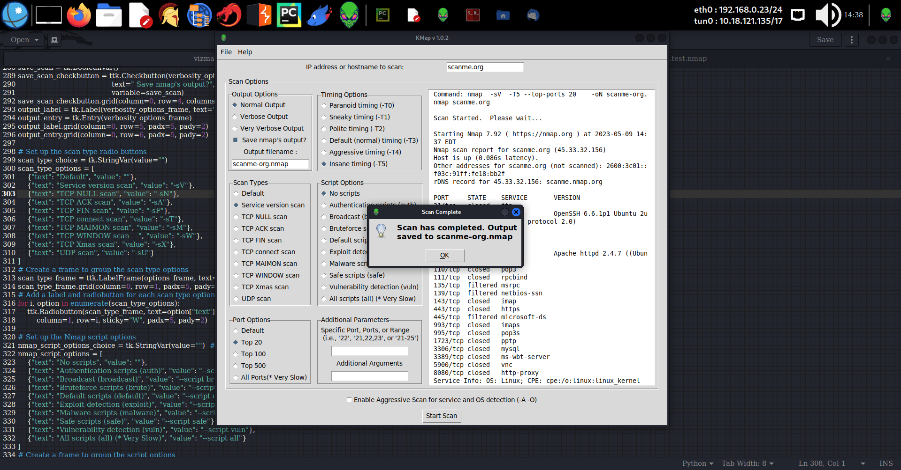

# KMap
>KMap is a user friendly tool for running various types of nmap scans allowing user to set scan parameters by making simple choices. The script prompts for an IP address to scan, and then presents a series of options for customizing the Nmap scan. The options include selecting the type of scan, the timing option, the script option, the port scan option, and whether to use aggressive scanning and OS detection, as well as whether to save the output from the scan. KMap is only for use on Linux systems.  It is not designed for, nor compatible with any version of Windows, though it can be modified easily for use under Windows.  As a Linux tool, I make no claims regarding it's use under Windows other than that this will not work under Windows as-is.

### Dependencies:
- nmap
    ```
    sudo apt install nmap
    ```
- If you're using the Python version, check the import statements to assure that you have all of the required modules installed.  Most of the modules used are standard python libraries.    


## KMap in Python
The python version of KMap provides a graphical user interface solution for running nmap scans in Linux.

### Installing and Running KMap Python
```
git clone https://github.com/kaotickj/KMap.git
cd KMap
python3 kmap.py
```


- Enter an ip address or domain to scan in the input labelled, "IP address or hostname to scan:"
- Choose a verbosity option or leave it at the default setting
- If you want to save nmap's output to a file, select the "Save nmap's output" checkbox and enter a filename to save it as.  *** Please note that if you want to later load the scan results into KMap, you should save it with a .nmap extension.
- Choose a script option, or leave the default no scripts setting
- Choose a scan type.  Default is TCP SYN scan (-sS)
- Set a timing option, or leave the default timing as is
- Select a port option to configure ports to scan or leave it set at default
- Choose specific port or port range options by entering them into the input field as a single port (i.e., "22"), a comma separated list of ports (i.e., "21,22,23,25"), or a range of ports (i.e., "21-25"). ### NOTE: Setting this overrides the previous port options setting 
- Add any additional arguments such as Service scan: -sV, no ping: -Pn, or other scan types in addition to the chosen scan type.  Accepts any valid nmap commands.  Use -h here for nmap's help
- For aggressive service and OS detection, check the box
- Once all options are set, hit the "Start Scan" button.

##### To get the most out of both nmap and KMap, See:
The Official Nmap Project Guide to Network Discovery and Security Scanning
https://nmap.org/book/toc.html


### Installing KMap Shell script
> First of all, the python version provides an intuitive and user friendly Graphic Interface for generating nmap scans.  It's as simple to install as the shell script, and even simpler to use, so why not give it a try first.  If you still want to use this outdated shell version:

```
git clone https://github.com/kaotickj/KMap.git
```

#### Usage:
* add executable permission:
 ```
 chmod +x kmap.sh
 ```
 * Run:
 ```
 ./kmap.sh
 ```
 

After the "splash screen" loads, hit enter, and follow the prompts to enter the parameters for the scan.
After collecting all of the options, the script constructs the appropriate command-line arguments for the nmap command and runs the scan with sudo nmap. Finally, the script displays a message indicating that the scan is complete and, if the user chose to save the output, the filenames of the saved results.